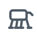

  Hi here, I'm <b>Yinglei-Zhu / FlyPigTH</b> · PhD @ THU · <code>zylbhsf@gmail.com</code>  
  <b>Research:</b> modeling &amp; simulation <a href="https://arxiv.org/abs/2511.07887"><u>RA-L EquiMus</u></a> · soft actuation <a href="https://doi.org/10.1109/TRO.2025.3567801"><u>T-RO Bionic Leg</u></a> · wheel-legged locomotion <a href="https://arxiv.org/abs/2504.21767"><u>IROS Whleaper</u></a> 
  <b>Robots:</b> wheel-legged  · quadrotor  · quadruped  · humanoid 

  <b>Tech Stack</b> 
  
  
  
  
  
  
  
  
  
  
  
  
  
  
  
  

